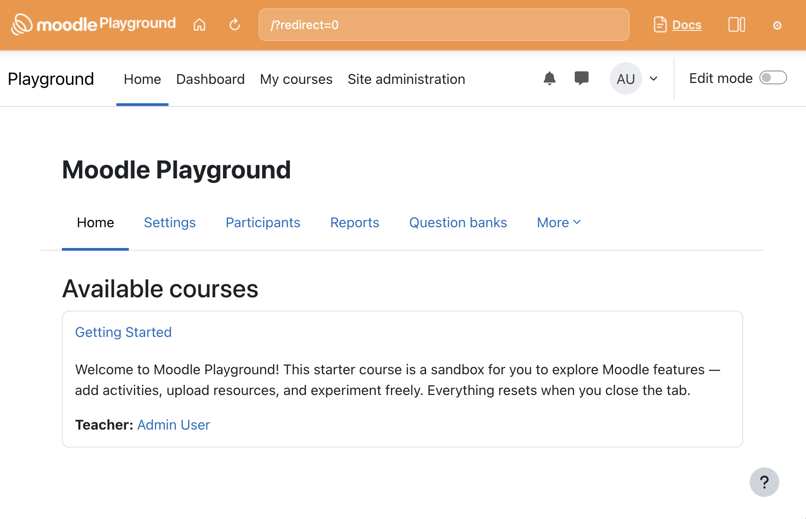

# Moodle Playground

<p align="center">
  
</p>

[Live demo](https://ateeducacion.github.io/moodle-playground/) · [Documentation](docs/) · [Blueprints](docs/blueprint-json.md)

> Run a full Moodle site in the browser — no server required.

Moodle Playground runs [Moodle](https://moodle.org) entirely in the browser using WebAssembly, powered by [WordPress Playground](https://github.com/WordPress/wordpress-playground)'s `@php-wasm/web` runtime. Every page load boots a fresh Moodle instance with a pre-built SQLite snapshot — nothing is stored on disk and nothing leaves your browser.

## Getting Started

### Try it online

Open the [live demo](https://ateeducacion.github.io/moodle-playground/) — no install needed.

### Run it locally

```bash
git clone https://github.com/ateeducacion/moodle-playground.git
cd moodle-playground
make up
```

Then open <http://localhost:8080>.

### Prerequisites

- Node.js 18+
- npm
- Python 3 for Moodle patch/build helpers and docs
- PHP 8.3 with `pdo_sqlite` (for `make up-local`)
- Git

## How It Works

```text
index.html          Shell UI (toolbar, address bar, log panel)
  └─ remote.html    Runtime host — registers the Service Worker
       ├─ sw.js     Intercepts requests → routes to PHP worker
       └─ php-worker.js
            └─ @php-wasm/web (WebAssembly, PHP 8.3)
                 ├─ Moodle core in writable MEMFS  (extracted from ZIP bundle)
                 └─ In-memory state                (SQLite + moodledata in MEMFS)
```

1. The shell boots a scoped runtime host inside an iframe.
2. The Service Worker intercepts all requests under `/playground/<scope>/<runtime>/…`.
3. The PHP worker extracts the Moodle ZIP bundle into writable MEMFS and loads a pre-built install snapshot.
4. Moodle runs against an in-memory SQLite database — fully ephemeral, no persistence.
5. If the PHP runtime crashes (WASM OOM / file descriptor exhaustion), the worker snapshots the DB and user files, boots a fresh runtime, and restores state automatically.

**Default credentials:** username `admin`, password `password`.

### No persistence by design

All state lives in memory (Emscripten MEMFS). Closing the tab destroys everything. This is intentional — the playground is meant for exploration, demos, and testing, not for storing data.

## Blueprints

Blueprints are step-based JSON files that configure and provision a playground instance at boot. Inspired by [WordPress Playground Blueprints](https://wordpress.github.io/wordpress-playground/), they use Moodle-native naming and semantics.

```json
{
  "landingPage": "/course/view.php?id=2",
  "steps": [
    { "step": "installMoodle", "options": { "siteName": "My Moodle" } },
    { "step": "login", "username": "admin" },
    { "step": "installMoodlePlugin", "url": "https://github.com/moodlehq/moodle-block_participants/archive/refs/heads/master.zip" },
    { "step": "createCourse", "fullname": "Physics 101", "shortname": "PHYS101" },
    { "step": "addModule", "module": "label", "course": "PHYS101", "name": "Welcome", "intro": "<p>Hello World!</p>" }
  ]
}
```

A default blueprint is bundled at [`assets/blueprints/default.blueprint.json`](assets/blueprints/default.blueprint.json). Override it by:

- Passing `?blueprint=<inline-json-or-base64>` or `?blueprint-url=<url>` in the URL
- Importing a `.json` file from the shell toolbar

Blueprints can provision:

- Site title, locale, timezone, and admin credentials (`installMoodle`)
- User sessions (`login`)
- Additional users (`createUser`, `createUsers`)
- Course categories (`createCategory`, `createCategories`)
- Courses and sections (`createCourse`, `createCourses`, `createSection`)
- Enrolments (`enrolUser`, `enrolUsers`)
- Course modules (`addModule` — label, assign, folder, etc.)
- Plugins and themes from ZIP URLs (`installMoodlePlugin`, `installTheme`)
- Moodle config values (`setConfig`, `setConfigs`)
- Filesystem operations (`writeFile`, `mkdir`, `unzip`, etc.)
- Arbitrary PHP code (`runPhpCode`, `runPhpScript`)

Use `constants` for `{{PLACEHOLDER}}` substitution and `resources` for named file references.

See the [Blueprint reference](docs/blueprint-json.md) for the full format, all step types, and examples. A sample blueprint is at [`blueprint-sample.json`](blueprint-sample.json).

Schema: [`assets/blueprints/blueprint-schema.json`](assets/blueprints/blueprint-schema.json).

See the [development docs](docs/development.md) and [`AGENTS.md`](AGENTS.md) for the full command reference.

## Contributing

Contributions are welcome. See the [development docs](docs/development.md) to get started.

## License

See [LICENSE](LICENSE).
