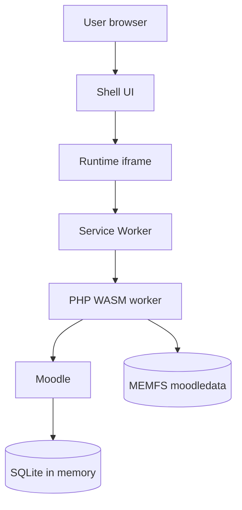

# Moodle Playground

**Run a full Moodle site entirely in your browser — no server, no install, nothing leaves your machine.**

Moodle Playground boots a real Moodle LMS on WebAssembly (PHP compiled to WASM, powered by [WordPress Playground](https://github.com/WordPress/wordpress-playground)). Every tab is a disposable, in‑memory instance you can shape with a small JSON [blueprint](blueprints/index.md).

[:material-rocket-launch: Open Playground](https://moodle-playground.com){ .md-button .md-button--primary }
[:material-github: View on GitHub](https://github.com/ateeducacion/moodle-playground){ .md-button }
[:material-code-braces: Read Blueprints](blueprints/index.md){ .md-button }
[:material-source-pull: Use PR Preview Action](github/pr-previews.md){ .md-button }

## What it's for

- :material-puzzle: **Plugin developers** — test a plugin from a GitHub branch in seconds, then add a [PR preview button](github/pr-previews.md) so reviewers can try it in the browser.
- :material-school: **Teachers & trainers** — explore activities or run a workshop where every attendee gets their own throwaway Moodle.
- :material-flask: **QA & demos** — reproduce a specific Moodle/PHP version, or ship a shareable demo course as a single [blueprint](blueprints/index.md) URL.

!!! tip "Default credentials"
    Username `admin`, password `password`. Change them with an `installMoodle` step in your blueprint.

!!! warning "Ephemeral by design"
    All state lives in memory. A reload keeps your data *within the same tab*; closing the tab destroys everything. It is built for exploration and testing, not for storing real data.

## A minimal blueprint

A blueprint is a JSON file that provisions an instance at boot. This one installs Moodle, logs in as admin, and creates a course:

```json
{
  "steps": [
    { "step": "installMoodle", "options": { "siteName": "My Moodle" } },
    { "step": "login", "username": "admin" },
    { "step": "createCourse", "fullname": "Physics 101", "shortname": "PHYS101" }
  ]
}
```

Load any blueprint by URL:

```
https://moodle-playground.com/?blueprint-url=/assets/blueprints/examples/minimal.blueprint.json
```

See the [blueprint overview](blueprints/index.md), [examples](blueprints/examples.md), and [full reference](blueprints/reference.md).

## How it works



The shell hosts a scoped runtime iframe; a service worker routes requests to a PHP‑WASM worker that boots Moodle from a prebuilt snapshot into in‑memory storage. See the [architecture overview](architecture.md).

## Where to go next

<div class="grid cards" markdown>

- :material-rocket-launch: **[Quick start](getting-started.md)** — try it online or run it locally in three commands.
- :material-application-cog: **[Basic usage](usage.md)** — the shell UI, loading blueprints, limitations.
- :material-code-braces: **[Blueprints](blueprints/index.md)** — provision users, courses, plugins, and more.
- :material-source-pull: **[PR previews](github/pr-previews.md)** — add a one‑click preview button to plugin pull requests.
- :material-sitemap: **[Architecture](architecture.md)** — how the pieces fit together.
- :material-hammer-wrench: **[Contributing](maintainers/contributing.md)** — build, test, and extend the project.

</div>

---

Made with :material-heart:{ .heart } by [Área de Tecnología Educativa](https://www3.gobiernodecanarias.org/medusa/ecoescuela/ate/)

Moodle™ is a registered trademark of [Moodle Pty Ltd](https://moodle.com/trademarks/).
Moodle Playground is an independent project and is not affiliated with, endorsed by, or
sponsored by Moodle Pty Ltd.
