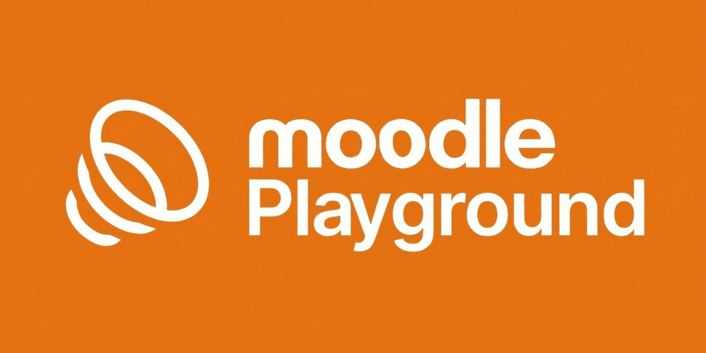

# Moodle Playground

<p align="center">
  
</p>

**Moodle running entirely in your browser, via WebAssembly.** No server, no installation, no data leaves your machine.

[](https://moodle-playground.com)
[](https://github.com/ateeducacion/moodle-playground)
[](https://github.com/ateeducacion/moodle-playground/blob/main/LICENSE)

## What is this?

Moodle Playground lets you run a **full Moodle LMS instance in your browser** for learning, testing, and prototyping course experiences. Perfect for:

- :material-school: **Teachers** evaluating new activities without touching a production server
- :material-puzzle: **Plugin developers** testing changes before pushing to a live site
- :material-book-open: **Trainers** giving workshops where every attendee gets a disposable Moodle
- :material-flask: **Researchers** reproducing a specific Moodle version in an isolated environment

The runtime is **fully ephemeral**: everything lives in memory and resets when you close the tab.

!!! tip "Default credentials"
    Username `admin`, password `password`. Override them via a blueprint if needed.

## How it works

The project is a layered architecture with clear boundaries:

``` { .text .no-copy }
┌─────────────────────────────────────────────────────────┐
│  Shell UI  (index.html · src/shell/main.js)             │
│     toolbar · URL bar · iframe host · runtime logs      │
├─────────────────────────────────────────────────────────┤
│  Runtime host  (remote.html · src/remote/main.js)       │
│     registers the service worker                        │
├─────────────────────────────────────────────────────────┤
│  Request routing  (sw.js · php-worker.js)               │
│     intercepts HTTP requests, routes to PHP runtime     │
├─────────────────────────────────────────────────────────┤
│  PHP / Moodle runtime  (src/runtime/*)                  │
│     boots Moodle via @php-wasm/web                      │
├─────────────────────────────────────────────────────────┤
│  Generated assets  (assets/moodle/)                     │
│     prebuilt ZIP bundle (extracted into MEMFS at boot)  │
└─────────────────────────────────────────────────────────┘
```

See the [Architecture overview](architecture.md) for the full picture.

## Quick start

=== "Use it right now"

    Nothing to install — just open the hosted instance:

    <https://moodle-playground.com>

=== "Run it locally"

    ```bash
    # Clone
    git clone https://github.com/ateeducacion/moodle-playground.git
    cd moodle-playground

    # Install and build
    npm install
    make prepare
    make bundle

    # Start the dev server
    make serve
    ```

    Then open <http://localhost:8080>.

=== "Quick blueprint demo"

    Provision a site with a custom name and a demo course in one go:

    ```
    https://moodle-playground.com/?blueprint-url=/assets/blueprints/examples/demo-course.blueprint.json
    ```

    See the [Blueprint gallery](blueprint-gallery.md) for more.

## Features

<div class="grid cards" markdown>

- :material-language-php: **PHP 8.1 → 8.5**

    Version depends on the Moodle branch; default `8.3`.

- :material-school: **Moodle 4.4 / 5.0**

    Multiple upstream branches built at the same time.

- :material-database: **SQLite via PDO**

    Experimental driver patch — see [MDL-88218](https://moodle.atlassian.net/browse/MDL-88218).

- :material-rocket-launch: **Fast boot**

    Pre-built install snapshot boots in ~3 s vs ~8 s for a full install.

- :material-view-list: **Blueprints**

    Step-based JSON to provision users, courses, enrolments, modules, and more.

- :material-github: **Works on GitHub Pages**

    Subpath-aware; deployable as a static site.

</div>

## Where to go next

<div class="grid cards" markdown>

- :material-rocket-launch: **[Getting started](getting-started.md)**

    Local setup, build commands, and a first blueprint.

- :material-code-braces: **[Blueprint reference](blueprint-json.md)**

    The complete JSON schema for blueprint files.

- :material-image-multiple: **[Blueprint gallery](blueprint-gallery.md)**

    Ready-to-use blueprint examples for courses, users, plugins.

- :material-sitemap: **[Architecture](architecture.md)**

    How the shell, service worker and PHP-WASM runtime fit together.

- :material-lightbulb-on: **[Troubleshooting](TROUBLESHOOTING.md)**

    Common failure modes and how to fix them.

- :material-alert-circle: **[Known issues](KNOWN-ISSUES.md)**

    Upstream bugs and limitations we are tracking.

</div>

## CI/CD and GitHub Actions

The project includes a reusable GitHub Action for live PR previews:

- [**action-moodle-playground-pr-preview**](https://github.com/ateeducacion/action-moodle-playground-pr-preview) — Deploys a temporary Moodle Playground instance for each pull request so reviewers can test changes in the browser before merging.

The main CI/CD pipeline (`.github/workflows/ci.yml`) handles linting, unit tests, Playwright E2E (Chromium + Firefox), and deployment to GitHub Pages on push to `main`.

---

Made with :material-heart:{ .heart } by [Área de Tecnología Educativa](https://www3.gobiernodecanarias.org/medusa/ecoescuela/ate/)
